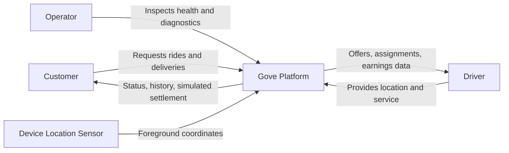
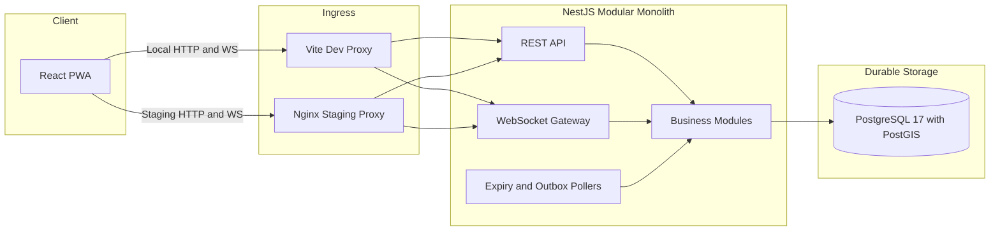
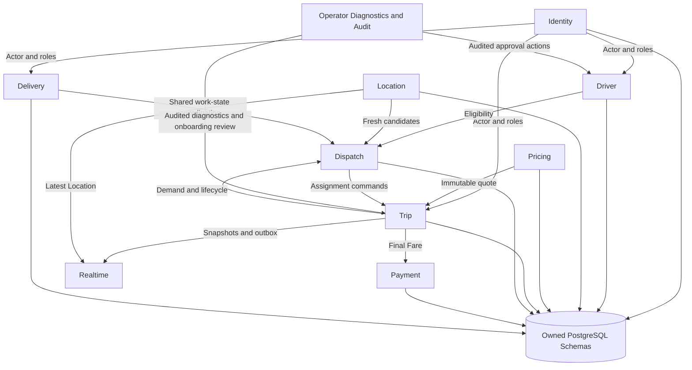
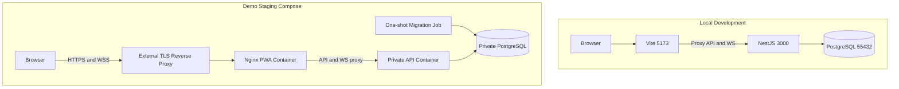
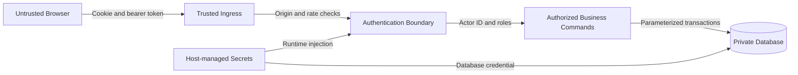

# Sơ Đồ Kiến Trúc

Trạng thái: Implementation hiện tại nếu không có ghi chú khác
Cập nhật lần cuối: 2026-09-25

## D-01 — Bối cảnh hệ thống

Phạm vi hiện tại không bắt buộc map, routing, notification hoặc payment
provider trả phí. Payment được mô phỏng và tọa độ có thể nhập thủ công.

## D-02 — Kiến trúc runtime

Vite và Nginx là hai lựa chọn theo môi trường. PostgreSQL/PostGIS có thẩm quyền;
Redis và message broker chưa thuộc runtime hiện tại.

## D-03 — Quyền sở hữu module

Các cạnh mô tả interface hoặc phối hợp transaction, không cấp quyền cập nhật
trực tiếp bảng thuộc module khác.

## D-04 — Triển khai local và staging

Stack staging đã được kiểm thử local. TLS reverse proxy bên ngoài và VPS định
danh vẫn là bằng chứng deployment có điều kiện.

## D-05 — Trust boundary bảo mật

Trình duyệt kiểm soát payload nhưng không kiểm soát actor ID, Fare, ownership
của assignment hoặc quyền chuyển trạng thái. Refresh token nằm trong HttpOnly
cookie; access token chỉ được giữ trong bộ nhớ PWA.
