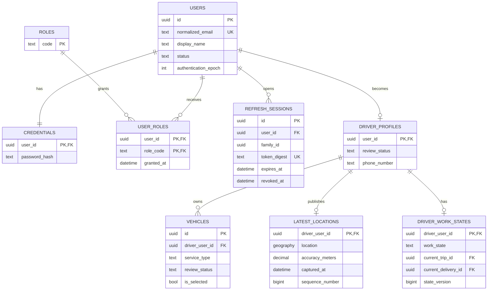
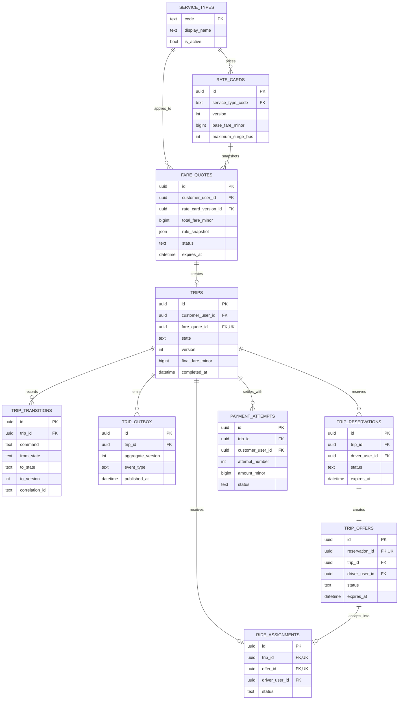
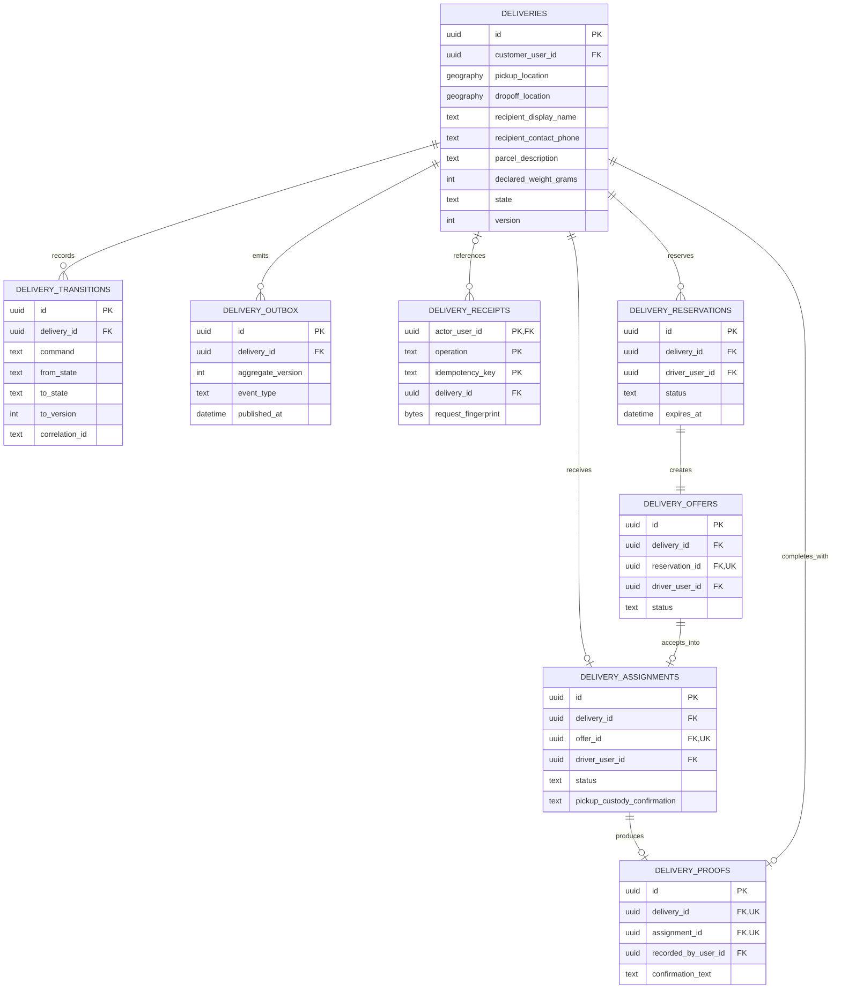

# Sơ Đồ Mô Hình Dữ Liệu

Trạng thái: Phản ánh migration 0002–0009
Cập nhật lần cuối: 2026-09-24

ERD chỉ hiển thị các cột quan trọng để hình còn đọc được. SQL migration là
nguồn sự thật cho toàn bộ cột, constraint và index.

## D-16 — Identity và Driver

## D-17 — Pricing, Trip, Dispatch và Payment

## D-18 — Delivery, custody và proof

Quan hệ giữa Identity/Driver với các ERD còn lại được lược bớt để tránh hình quá
dày. Các cột `customer_user_id`, `driver_user_id`, `actor_user_id` và
`recorded_by_user_id` đều tham chiếu về bảng owner tương ứng.
