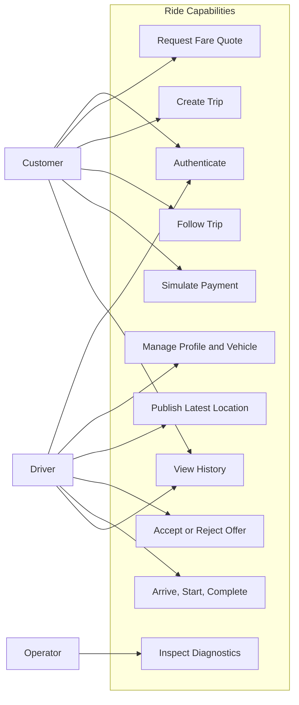
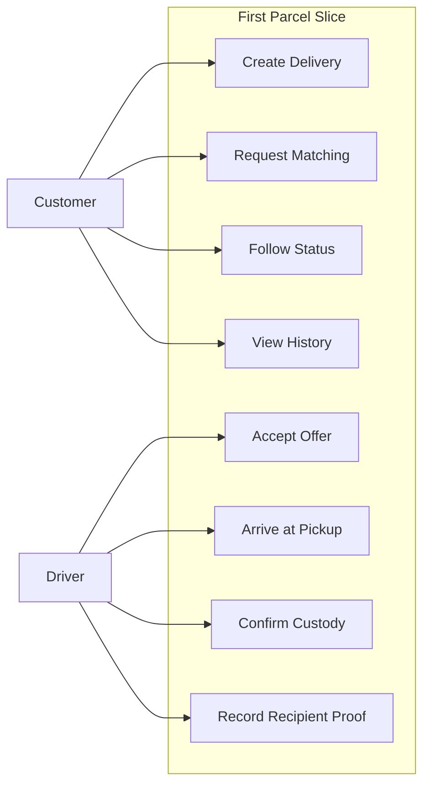
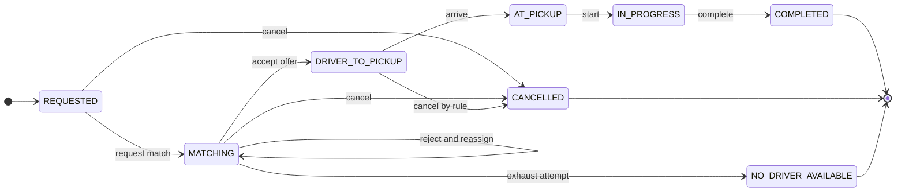
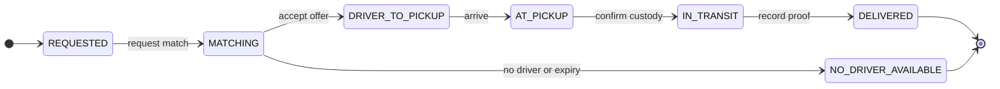

# Sơ Đồ Domain và Use Case

Trạng thái: Hỗn hợp; phần chưa hoàn thiện được ghi chú riêng
Cập nhật lần cuối: 2026-09-24

## D-06 — Năng lực actor trong Ride

Các năng lực Customer và Driver trong hình đã được triển khai local. Metric cho
Operator đã có, nhưng action/audit đầy đủ theo FR-18 vẫn còn thiếu.

## D-07 — Năng lực actor trong Parcel Delivery

Backend và Driver Console đã hỗ trợ lifecycle trong hình. UI tạo Delivery và
trạng thái live cho Customer còn thiếu; lịch sử Customer qua HTTP đã có.

## D-08 — State machine của Trip

Trạng thái cancellation tồn tại trong model, nhưng API và bằng chứng nghiệm thu
cuối cùng vẫn đang mở trong acceptance matrix.

## D-09 — State machine của Delivery

Database model có dự phòng `CANCELLED`, nhưng hình không biểu diễn vì Delivery
slice đầu tiên chưa có command hoặc rule cancellation.
