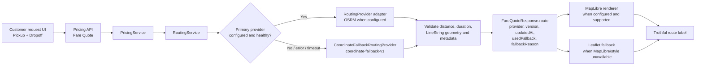

# D-19 — Map và Routing Provenance

Trạng thái: Implemented locally; runtime/provider/browser evidence còn Partial

Sơ đồ này mô tả boundary hiện có trong `apps/api/src/routing/**`, Pricing
flow và Customer map renderer. `CoordinateFallbackRoutingProvider` chỉ là
coordinate estimate; không được gọi là road route hoặc shortest route.

## Evidence boundary

- Routing unit tests cover fallback output, provider metadata, provider error,
  timeout/abort và invalid input.
- Pricing tests cover route provenance and prevent the fallback from being
  presented as a road route.
- Browser evidence covers the Leaflet/coordinate fallback path. OSRM runtime,
  MapLibre success path, external tile availability and road-based ETA are not
  established by this diagram.

## Nguồn đối chiếu

- `apps/api/src/routing/routing.service.ts`
- `apps/api/src/routing/routing.types.ts`
- `apps/api/src/pricing/pricing.service.ts`
- `apps/api/src/routing/routing.service.spec.ts`
- `docs/architecture/map-and-eta.md`
