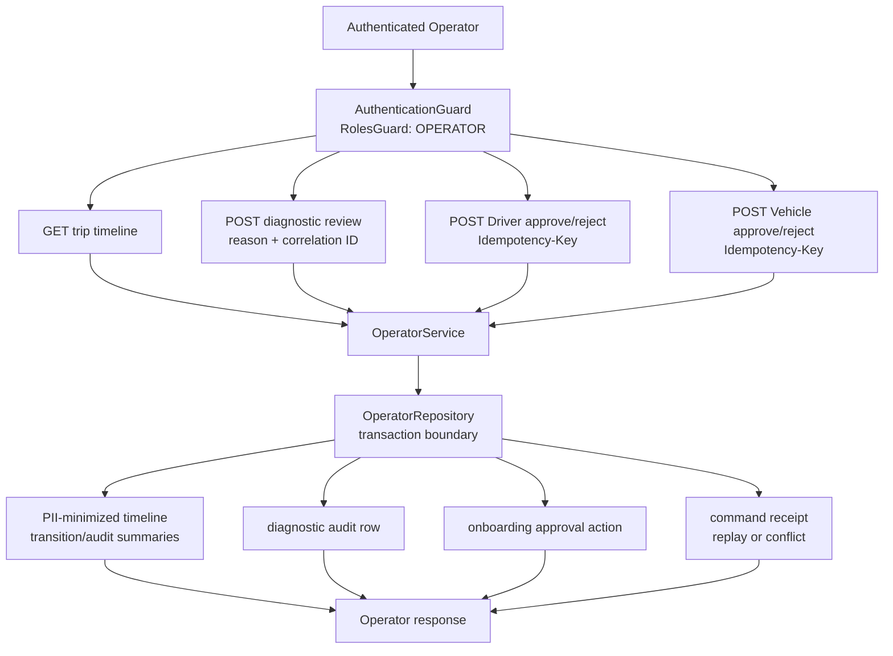

# D-20 — Operator Review và Audit Boundary

Trạng thái: Implemented and tested locally; browser Operator evidence còn thiếu

Sơ đồ mô tả hai nhánh đã có của Operator boundary: Trip diagnostics tối giản
PII và Driver/Vehicle onboarding review có idempotency. Operator không được xem
Customer/Driver identity, location hoặc payment data qua Trip timeline.

## Evidence boundary

- Integration tests cover unauthenticated and non-Operator rejection, input
  validation, missing Trip, PII-minimized timeline and durable diagnostic audit.
- Onboarding integration tests cover approval/rejection, ownership, second
  review conflict, durable audit and idempotent replay.
- Browser Operator flow and a pending-review list endpoint are not claimed.

## Nguồn đối chiếu

- `apps/api/src/operator/operator.controller.ts`
- `apps/api/src/operator/operator.service.ts`
- `apps/api/src/operator/operator.repository.ts`
- `apps/api/src/operator/operator.integration.spec.ts`
- `docs/api/operator-diagnostics.md`
- `infra/postgres/migrations/0010-operator-diagnostic-audit.sql`
- `infra/postgres/migrations/0012-driver-onboarding-approval-audit.sql`
- `infra/postgres/migrations/0014-operator-onboarding-idempotency.sql`
