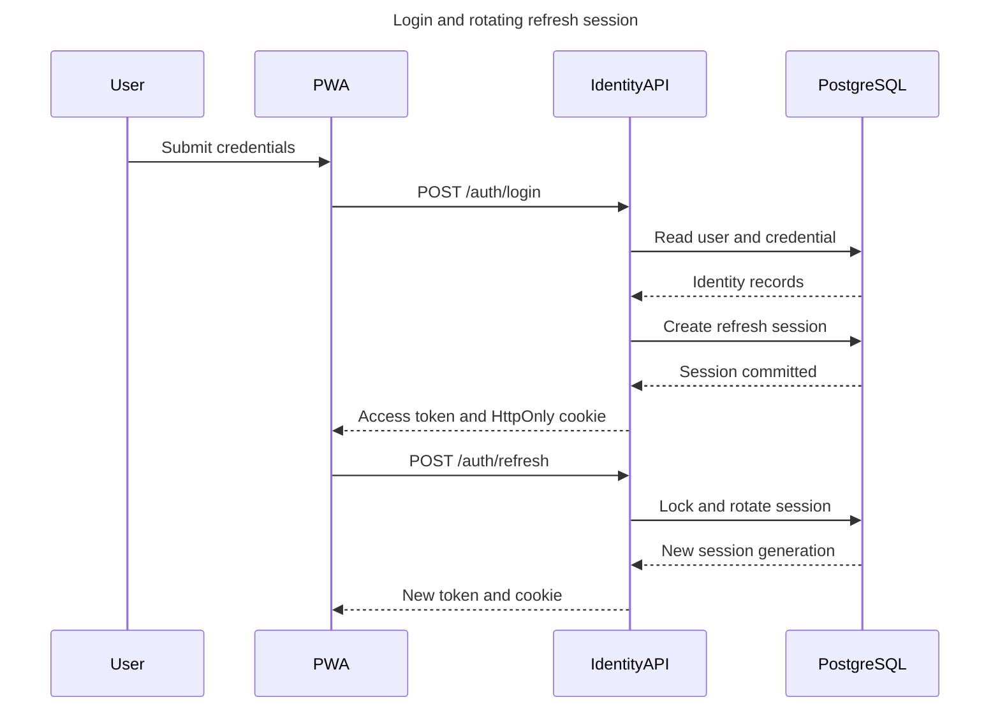
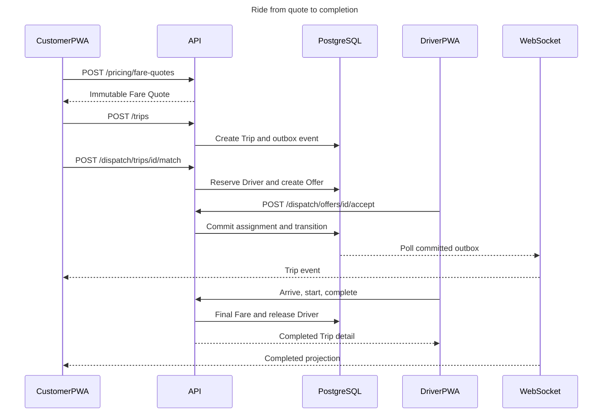
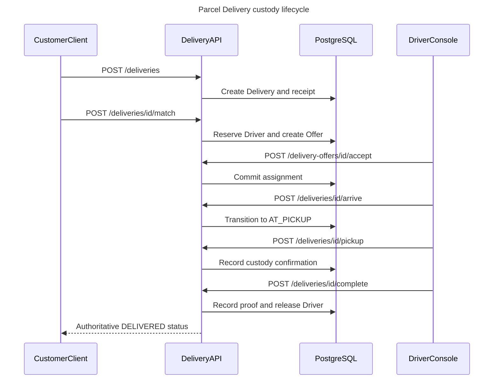
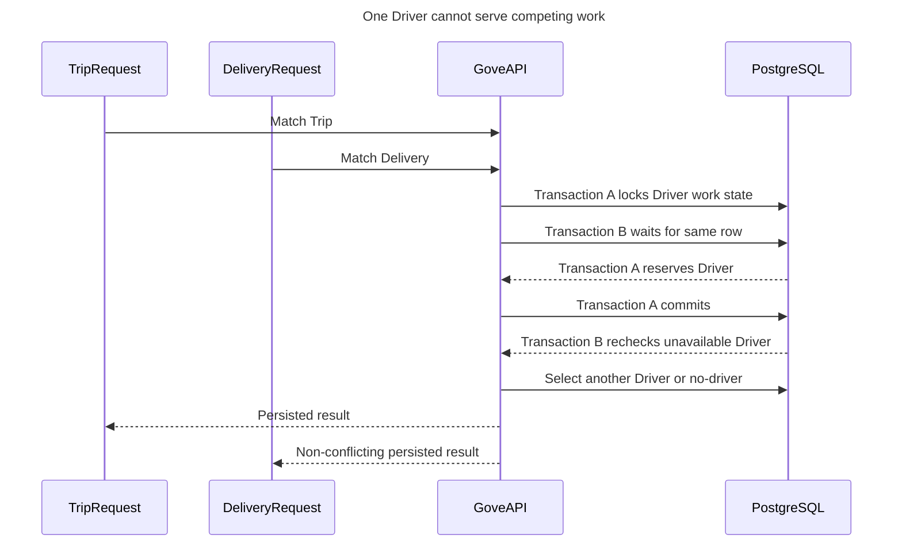
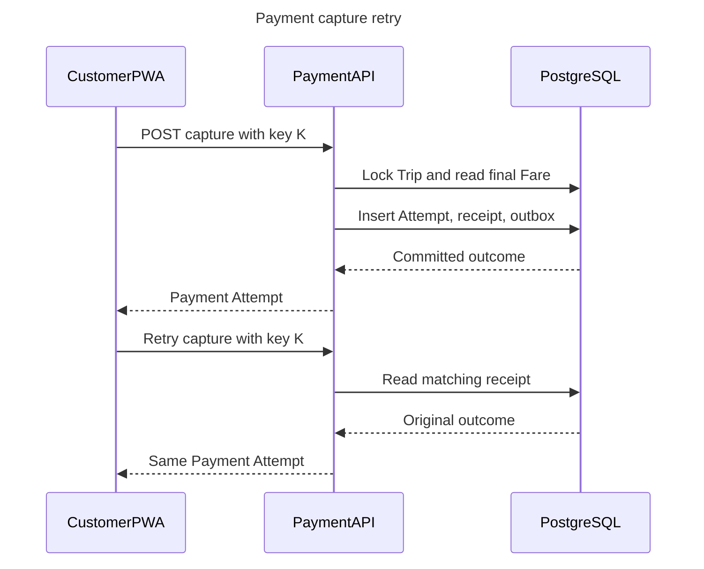
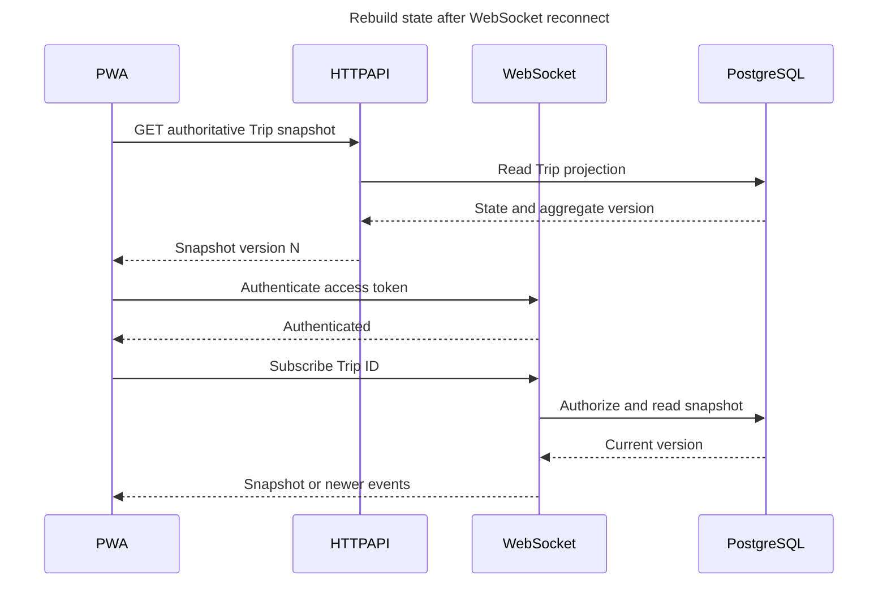

# Sơ Đồ Tuần Tự

Trạng thái: Implementation hiện tại nếu không có ghi chú khác
Cập nhật lần cuối: 2026-09-24

## D-10 — Đăng nhập và xoay vòng refresh session

## D-11 — Luồng Ride thành công

Payment capture được tách thành D-14 vì settlement có idempotency và failure
lifecycle riêng.

## D-12 — Luồng Delivery thành công

Backend và Driver Console đã có. UI tạo Delivery và WebSocket projection cho
Customer còn thiếu; trạng thái cuối hiện có thể đọc qua HTTP/history.

## D-13 — Tranh chấp Driver giữa Trip và Delivery

Shared work-state constraint và transaction đã được triển khai. Stress gate
lặp lại trên hai domain vẫn còn Pending trong acceptance matrix.

## D-14 — Payment mô phỏng có idempotency

## D-15 — Phục hồi sau reconnect realtime

Client dùng aggregate version làm ordering guard và loại projection cũ hoặc
trùng lặp.
