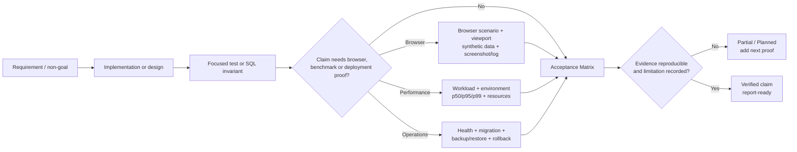

# D-21 — Verification Gates Cho Báo Cáo

Trạng thái: Quy trình báo cáo hiện hành

Đây là sơ đồ phương pháp kiểm chứng, không phải sơ đồ runtime và không thay
thế kết quả test. Một claim chỉ đi tới báo cáo cuối khi loại evidence phù hợp
với claim đã được lưu và trạng thái trong Acceptance Matrix được cập nhật.

## Quy tắc sử dụng

- `Implemented` không tự động trở thành `Verified`.
- Test tự động không thay thế browser, benchmark hoặc deployment evidence khi
  acceptance gate yêu cầu các loại đó.
- Local Compose không được gọi là VPS deployment.
- Smoke workload không được dùng để kết luận production capacity.
- Mọi gap còn lại phải xuất hiện trong acceptance matrix và known limitations.

## Nguồn đối chiếu

- `docs/project/completion-definition.md`
- `docs/project/acceptance-matrix.md`
- `docs/report/evidence-guide.md`
- `docs/report/evidence-register.md`
